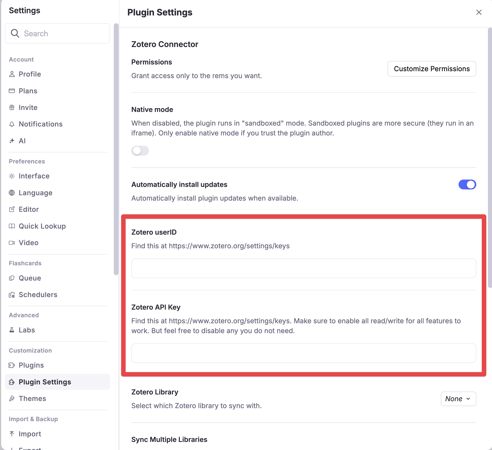
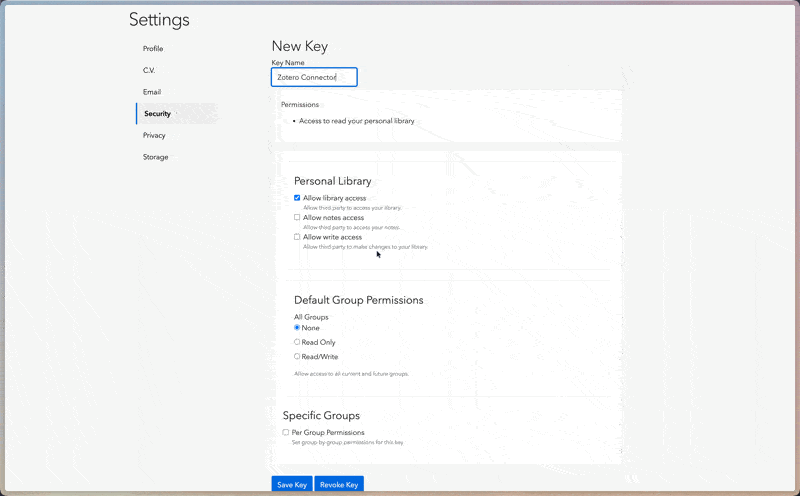
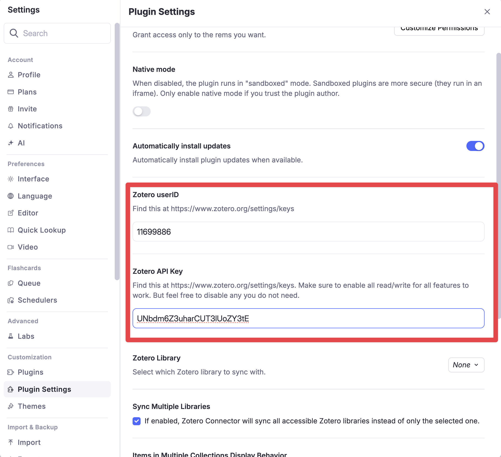

<h1 align="center">
    
</h1>

<h3 align="center">
    📚 Zotero Connector
</h3>

    <i>Streamlined reference management and Zotero Integration for RemNote</i>

    
    
    

> **Beta** – This is the first public pass of the Zotero Connector. Features and settings may change before the stable release.

## Overview

The Zotero Connector syncs your Zotero library into RemNote and provides tools for working with citations and sources.

## Features

-   Zotero library sync (items, notes, tags)
-   Reference papers directly from your Zotero library
-   RemNote Reader compatibility
-   Friendly interface for managing sync
-   Automated sync intervals (configurable)

## Installation

1. In RemNote, open **Settings → Plugins**.
2. Search for **Zotero Connector** and click **Install**. You can also find it in the [RemNote Plugin Store](https://www.remnote.com/plugins/zotero).

    

3. Open the plugin **Settings** panel.

    

4. Follow the link to [https://www.zotero.org/settings/keys](https://www.zotero.org/settings/keys) and sign in to your Zotero account.
5. Ensure you remain on that URL, then copy your **User ID** and generate a new **API key**. Grant at least the **Read** permissions.

    

6. Paste the **User ID** and **API key** into the plugin settings in RemNote.
7. Reload RemNote to populate the **Zotero Library** dropdown.
8. Select a library to sync or enable **Sync Multiple Libraries** to import everything automatically.

    

## Settings Reference

-   **Zotero UserID** – your Zotero account ID from the Zotero API settings page.
-   **Zotero API Key** – API key generated for the connector.
-   **Zotero Library** – library to sync (appears after an app reload).
-   **Sync Multiple Libraries** – syncs all accessible libraries when enabled.
-   **Items in Multiple Collections Display Behavior** – choose `Portal` to link all instances of an item or `Reference` to create separate copies in each collection.
-   **Disable Auto Sync** – prevents automatic synchronization every five minutes.
-   **Simple Syncing Mode** – skips metadata (notes, dates, etc.) when importing items.
-   **Citation Format** – formatting style for citations and bibliographies (APA, MLA, etc.).
-   **Citation Source** – choose where citation data comes from (`Zotero`, `Wikipedia`, or `Both`).
-   **Debug Mode (Zotero Connector)** – exposes extra diagnostic commands and enables verbose logging. (please use this when reporting bugs and sending console logs! 🙏)
-   **Select Next Key** – key to move down in the citation finder widget.
-   **Select Previous Key** – key to move up in the citation finder widget.
-   **Select Item Key** – key to insert the selected citation.
-   **Escape Key** – key to close the citation finder widget.

## Commands

The connector provides several command palette actions. Each command can be typed directly in RemNote or triggered via its quick code.

-   **Copy Citation via Zotero** (`citez`) – copy formatted citations for the focused Rem's sources.
    <!--  -->
-   **Copy Bibliography via Zotero** (`bibz`) – copy bibliography entries for the focused Rem's sources.
    <!--  -->
-   **Copy Citation via Wikipedia** (`citew`) – fetch citations without using Zotero.
    <!--  -->
-   **Copy Bibliography via Wikipedia** (`bibw`) – fetch bibliography entries without using Zotero.
    <!--  -->
-   **Force Zotero Sync** (`sync`) – immediately synchronize your Zotero library.
-   **Abort Zotero Sync** – stop the current sync job.
-   **Reset Synced Zotero Data** (`rszd`) – remove all Zotero Connector data from this knowledge base.

Additional diagnostic commands become available when **Debug Mode** is enabled.

## Development Roadmap

**Next Steps:**

-   [x] Installation and setup documentation
-   [ ] Bibliography generation from source links
-   [ ] Advanced citation features
-   [ ] Source aggregation tools
-   [x] Background sync automation
-   [ ] Bibliography generation from RemNote source links
-   [ ] Improve citation detection and formatting
-   [ ] Better installation and setup process

**Future Goals:**

-   Complete bidirectional sync between Zotero and RemNote
-   Enhanced RemNote source management tools
-   Citation style formatting options

## Issues and Feedback

Please report bugs or suggest features via [GitHub Issues](https://github.com/coldenate/zotero-remnote-connector/issues).
